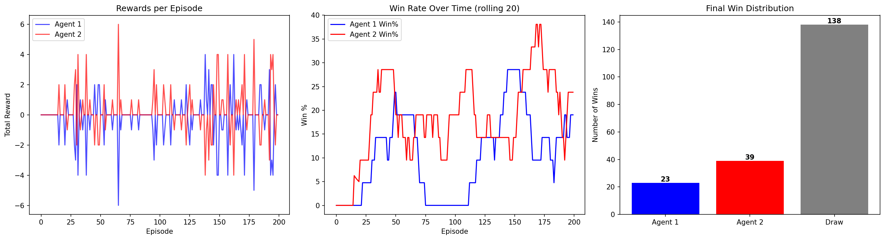

# 🥊 Multi-Agent Atari Boxing with Deep Q-Learning


> Two AI agents learn to compete in Atari Boxing using Deep Q-Networks — no human input, no hardcoded rules. Pure reinforcement learning from raw pixels.

---

## 📊 Results

| Metric | Value |
|--------|-------|
| Total Episodes | 200 |
| Agent 2 Wins | 39 (62% of decisive games) |
| Agent 1 Wins | 23 (37% of decisive games) |
| Draws | 138 (69% of all episodes) |
| Training Time | ~12 minutes (T4 GPU) |
| Max Reward | +6 / -6 per episode |

---

## 🎯 Project Overview

**Multi-Agent Atari Boxing DQN** is a reinforcement learning project where two independent DQN agents are trained to compete against each other in the classic Atari Boxing game using the PettingZoo multi-agent framework.

Each agent:
- Observes raw pixel frames (210×160×3)
- Learns from its own experience using a replay buffer
- Maintains its own neural network, optimizer, and target network
- Competes against the other agent in real time

Neither agent is given any rules — they learn purely from rewards (+1 for landing a punch, -1 for receiving one).

---

## 🧠 How It Works

### Environment
- **Framework**: PettingZoo Atari Boxing v2 (AEC multi-agent model)
- **Observation Space**: `Box(0, 255, (210, 160, 3), uint8)` — raw RGB frame
- **Action Space**: `Discrete(18)` — 18 possible moves
- **Reward**: +1 for landing a punch, -1 for receiving one
- **Episode Length**: Up to 500 steps (capped for training efficiency)

### DQN Architecture

```
Input: 4 stacked grayscale frames (4 × 84 × 84)
       ↓
Conv2d(4, 32, kernel=8, stride=4)  → ReLU
       ↓
Conv2d(32, 64, kernel=4, stride=2) → ReLU
       ↓
Conv2d(64, 64, kernel=3, stride=1) → ReLU
       ↓
Flatten → Linear(3136, 512) → ReLU
       ↓
Linear(512, 18)  ← Q-value for each of 18 actions
```

### Key Techniques

| Technique | Description |
|-----------|-------------|
| **Experience Replay** | Stores 10,000 past (s, a, r, s', done) transitions. Random batch sampling breaks temporal correlation |
| **Target Network** | Frozen copy of online network, updated every 500 steps. Provides stable Q-value targets |
| **Frame Stacking** | 4 consecutive grayscale frames stacked → agent perceives motion and velocity |
| **Epsilon-Greedy** | ε starts at 1.0, decays to 0.1. Balances exploration vs exploitation |
| **Bellman Equation** | Q(s,a) = r + γ × max(Q(s′,a′)) with γ = 0.99 |
| **Frame Preprocessing** | RGB → Grayscale → Resize to 84×84 → Normalize to [0,1] |

---

## 📈 Training Progress

| Episode | Agent 1 Wins | Agent 2 Wins | Draws | ε |
|---------|-------------|-------------|-------|-------|
| 20      | 0           | 1           | 19    | 0.289 |
| 50      | 6           | 8           | 36    | 0.100 |
| 100     | 7           | 17          | 76    | 0.100 |
| 150     | 16          | 26          | 108   | 0.100 |
| 200     | 23          | 39          | 138   | 0.100 |



---

## 🗂️ Project Structure

```
Multi-Agent-Atari-Boxing-DQN/
│
├── Multi_Agent_Atari_Boxing.ipynb  ← Full training notebook (Colab)
├── training_results.png            ← Reward curves + win rate + win distribution
├── agent1_dqn.pth                  ← Trained Agent 1 model weights
├── agent2_dqn.pth                  ← Trained Agent 2 model weights
├── requirements.txt                ← Python dependencies
└── README.md
```

---

## ⚙️ Hyperparameters

| Parameter | Value |
|-----------|-------|
| Learning Rate | 0.0001 |
| Discount Factor (γ) | 0.99 |
| Replay Buffer Size | 10,000 |
| Batch Size | 16 |
| Epsilon Start | 1.0 |
| Epsilon Min | 0.1 |
| Epsilon Decay | 0.9995 |
| Target Network Update | Every 500 steps |
| Frame Stack Size | 4 |
| Input Frame Size | 84 × 84 |
| Training Episodes | 200 |
| Max Steps per Episode | 500 |

---

## 🛠️ Tech Stack

| Layer | Technology |
|-------|-----------|
| Language | Python 3.10 |
| Deep Learning | PyTorch 2.10 |
| RL Environment | PettingZoo (Atari Boxing v2) |
| Frame Processing | OpenCV |
| Visualization | Matplotlib |
| Training Hardware | Google Colab T4 GPU (15GB VRAM) |
| Notebook | Jupyter |

---

## 🚀 How to Run

### On Google Colab (recommended)
1. Open `Multi_Agent_Atari_Boxing.ipynb` in [Google Colab](https://colab.research.google.com)
2. Go to **Runtime → Change runtime type → T4 GPU**
3. Run all cells in order

### Local Setup
```bash
pip install -r requirements.txt
AutoROM --accept-license
jupyter notebook Multi_Agent_Atari_Boxing.ipynb
```

> ⚠️ Local setup requires CMake, Visual Studio Build Tools (Windows), and a CUDA-capable GPU for reasonable training speed.

---

## 💡 Key Learnings

- Multi-agent RL is harder than single-agent — both agents are simultaneously non-stationary targets for each other
- Epsilon decay speed is critical — too fast and agents stop exploring before learning meaningful behavior
- Frame stacking is essential for perceiving motion — a single frame gives no velocity information
- Target networks stabilize training significantly — without them Q-value estimates diverge
- 300+ episodes are needed for agents to develop consistent strategies with limited compute

---

## 👤 Author

**Smitkumar Velani**
MS Data Science — Northeastern University, Boston
[GitHub](https://github.com/Smit-Velani) | [LinkedIn](https://linkedin.com/in/smit-velani)

---

*Built with Python · PyTorch · PettingZoo · OpenCV · Matplotlib · Google Colab*
